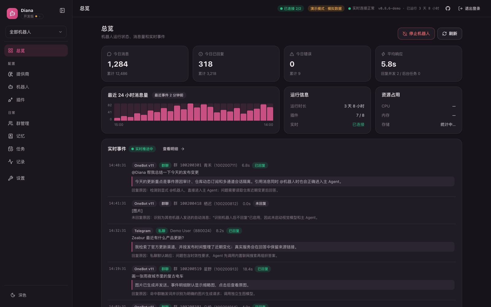

<div align="center">

# Diana

**可自托管的多平台 AI 助手 —— OneBot v11 与 Telegram 同时在线，数据留在自己的机器上。**

[](https://github.com/SuInk/Diana/actions/workflows/ci.yml)
[](https://github.com/SuInk/Diana/releases/latest)
[](https://go.dev/)
[](./LICENSE)

[官网与文档](https://suink.github.io/Diana/) · [在线演示](https://suink.github.io/Diana/demo/) · [下载最新版本](https://github.com/SuInk/Diana/releases/latest) · [English](./README.en.md)

</div>

<br />



## 目录

- [这是什么](#这是什么)
- [特性](#特性)
- [快速开始](#快速开始)
- [首次配置](#首次配置)
- [通道支持](#通道支持)
- [访问安全](#访问安全)
- [能力与扩展](#能力与扩展)
- [环境变量](#环境变量)
- [部署形态](#部署形态)
- [开发](#开发)
- [项目结构](#项目结构)
- [文档](#文档)
- [许可证](#许可证)

## 这是什么

Diana 是一个用 Go 写的多平台 AI 助手服务：内置 LLM 兼容层、平台适配层、Gin WebUI 和插件系统，编译成单个二进制运行。当前自带 OneBot v11 和 Telegram 两类通道，WebUI 可以管理多个机器人配置、模型分配、群聊策略、插件与内置 Agent。

配置、记忆、日志都存在本机的 SQLite 里，不依赖任何托管服务；每条消息为什么回复、为什么不回复、用了哪些工具、花了多少 token，都能在事件中心查到。

## 特性

| | |
| --- | --- |
| **多通道同时在线** | OneBot v11 与 Telegram 并行运行，回复、图片和提醒始终回到来源通道；会话上下文可按配置隔离或共享 |
| **模型职责拆分** | 对话、识图、意图识别、图片生成分别绑定 Provider 与模型，保存前用真实请求验证 |
| **内置联网搜索** | 无需安装插件，面对时效性内容可以先检索再回答；Exa MCP 优先，Tavily 兜底 |
| **图片文字识别** | 图片可同时走视觉模型与 OCR（LLM 转写 / 自托管 OCR 服务 / 本地 tesseract）；对话模型不支持看图时也能只收识别后的文字。识别结果按图片内容哈希落库，同一张图或表情包只识别一次 |
| **群级回复策略** | 每个群独立设置回复时段、黑白名单、触发词、人设、群等级门槛和工具权限 |
| **长期记忆与检索** | 近期上下文、压缩摘要、结构化事实和超长历史检索分层工作，控制 token 消耗 |
| **内置 Agent** | Pi 风格的最小工具循环，可调用文件、命令、浏览器工具，并按需装载 Skills 与 MCP 服务 |
| **完整事件审计** | 记录回复原因、模型调用链、token 与错误；操作日志区分操作人 |
| **一键安装与自更新** | 安装器校验 SHA-256、备份数据、健康检查失败自动回滚；控制台可直接升级 |

## 快速开始

### 一键安装（推荐）

安装脚本自动识别系统与架构，下载最新稳定版完整包，核对 `SHA256SUMS`，生成本地管理凭据并启动。**重复执行同一条命令即可安全升级**：升级前备份数据库和当前运行文件，健康检查失败时自动恢复。

```sh
# Linux / macOS
curl -fsSL https://raw.githubusercontent.com/SuInk/Diana/main/scripts/install.sh | sh
```

```powershell
# Windows PowerShell
irm https://raw.githubusercontent.com/SuInk/Diana/main/scripts/install.ps1 | iex
```

完成后打开 `http://127.0.0.1:18080`。首次生成的管理员账号和密码会显示在终端，并保存在安装目录的 `runtime.env`——请妥善保存，不要公开该文件。

默认安装目录：Linux / macOS 为 `~/.local/share/diana`，Windows 为 `%LOCALAPPDATA%\Diana`。

可以用环境变量选择版本、目录、端口或仅安装不启动：

```sh
curl -fsSL https://raw.githubusercontent.com/SuInk/Diana/main/scripts/install.sh | \
  DIANA_VERSION=v0.8.9 DIANA_INSTALL_DIR=/opt/diana DIANA_PORT=18081 sh
```

### Docker

```sh
git clone https://github.com/SuInk/Diana.git && cd Diana
cp docker-compose.yml docker-compose.local.yml
# 修改 docker-compose.local.yml 中的 token、账号和 LLM 配置
docker compose -f docker-compose.local.yml up -d --build
```

<details>
<summary><code>docker run</code> 方式</summary>

```sh
docker build -t diana:latest .

docker run -d \
  --name diana \
  --restart unless-stopped \
  -p 18080:18080 \
  -v "$PWD/data:/app/data" \
  -v "$PWD/logs:/app/logs" \
  -e LOG_PATH=/app/logs/diana.log \
  -e DIANA_ADMIN_PASSWORD=change-this-admin-password \
  -e DIANA_BOT_ENABLED=true \
  -e ONEBOT_REVERSE_WS_ENDPOINT=ws://127.0.0.1:18080/onebot/v11/ws \
  -e ONEBOT_ACCESS_TOKEN=your-onebot-token \
  -e DIANA_BOT_ACCOUNT=10001 \
  -e LLM_PROVIDER=openai_compatible \
  -e LLM_API_KEY=your-key \
  -e LLM_MODEL=gpt-4o-mini \
  diana:latest
```

</details>

容器启动后同样访问 `http://127.0.0.1:18080`；OneBot v11 客户端连接 `ws://127.0.0.1:18080/onebot/v11/ws`。客户端与 Diana 不在同一台机器时，把 `127.0.0.1` 换成 Diana 宿主机的 IP 或域名。

### Release 完整包

不使用安装脚本时，可从 [GitHub Releases](https://github.com/SuInk/Diana/releases) 下载完整包（Linux/macOS 用 `.tar.gz`，Windows 用 `.zip`）。包内含后端二进制、`frontend-next/dist` 和启动脚本，无需额外构建：Unix 运行 `run.sh`，Windows 运行 `run.bat`。

下载后先校验再替换程序，强制更新也不会绕过校验：

```sh
sha256sum -c SHA256SUMS --ignore-missing
```

> macOS 用 `shasum -a 256 <文件名>`，Windows 用 `Get-FileHash <文件名> -Algorithm SHA256`。

从完整 Release 包运行时，WebUI 可直接安装后续稳定版：下载对应平台的完整包，校验、备份并切换，探活失败自动恢复数据库与旧版本。备份保存在安装目录的 `.diana-updates` 下。容器部署由镜像更新器负责，源码 checkout 走 Git 更新流程。

### 从源码构建

面向开发和自定义部署。需要 Go `1.26.5`、Node.js `22` 和 npm。

```sh
git clone https://github.com/SuInk/Diana.git && cd Diana
go mod download

cd frontend-next && npm ci && npm run build && cd ..
go build -o dist/diana-webui ./cmd/webui

./dist/diana-webui
```

本机开发可以一条命令同时起后端和 Vite 前端：

```sh
make dev                                   # 后端 18080，前端 5173
make dev BACKEND_PORT=18081 FRONTEND_PORT=5174
node scripts/dev.mjs                       # 没装 make 时
```

## 首次配置

1. **登录控制台** —— 打开 `http://127.0.0.1:18080`，用终端给出的账号密码登录。
2. **配置模型** —— 在「LLM 配置」页填 Provider 与 API Key，同步模型列表后再选默认模型。也可以用环境变量预置：

   ```sh
   LLM_PROVIDER=openai_compatible \
   LLM_API_KEY=your-key \
   LLM_BASE_URL=https://example.com/v1 \
   LLM_MODEL=gpt-4o-mini \
   LLM_IMAGE_MODEL=gpt-image-1 \
   ./dist/diana-webui
   ```

   支持的 provider：`openai_compatible`、`gemini`、`anthropic`。支持命名保存多套配置并切换激活项。
3. **连接机器人** —— 在「机器人」页创建配置，填平台账号、主人 ID 和触发词。
4. **检查事件** —— 发一条消息，在事件中心确认回复原因与模型调用链。

<details>
<summary>用环境变量直接拉起一个 OneBot v11 机器人</summary>

```sh
DIANA_BOT_ENABLED=true \
ONEBOT_REVERSE_WS_ENDPOINT=ws://127.0.0.1:18080/onebot/v11/ws \
ONEBOT_ACCESS_TOKEN=your-onebot-token \
DIANA_BOT_ACCOUNT=10001 \
DIANA_GROUP_TRIGGERS=Diana,diana \
LLM_PROVIDER=openai_compatible \
LLM_API_KEY=your-key \
LLM_MODEL=gpt-4o-mini \
./dist/diana-webui
```

启动后私聊直接触发；群聊中 `@机器人` 或以触发词开头才触发。

</details>

## 通道支持

| 分类 | 平台 | 接入方式 |
| --- | --- | --- |
| OneBot v11 | OneBot v11 | 反向 WebSocket，由 OneBot v11 客户端连到 Diana（NapCat、Lagrange.Core、go-cqhttp 等同属这一类） |
| Telegram | Telegram Bot API | 官方长轮询，由 Diana 主动出站连接，不需要公网地址和 webhook |

所有启用的配置会同时在线。Telegram 只需要 BotFather 给的 Bot Token；国内网络通常还要在机器人页填代理地址，部署了本地 Bot API server 可填自建地址绕过 50MB 上传限制。

两个平台的能力差异：

- **群等级门槛只对 OneBot v11 生效**。Telegram 没有群等级概念，准入设置里不显示该项。
- **语音消息、@某人** 依赖 OneBot 的 CQ 码，Telegram 上自然降级：正文照发，但不会 @ 到人。
- **本地媒体**：OneBot 侧由接入端拉取 Diana 的 `/media/resolver` 地址；Telegram 拉不到本机地址，改为直接 multipart 上传。

## 访问安全

WebUI 从首次启动起强制登录，本机和公网访问同一套规则。默认管理员账号安全随机生成（`diana#` 加 16 位随机字符串），持久化在 SQLite。

- 首次启动未提供 `DIANA_ADMIN_PASSWORD` 时会生成随机密码，账号密码仅在该次启动的标准错误日志中显示一次。
- 也可在首次启动时注入 `DIANA_ADMIN_USERNAME` 和 `DIANA_ADMIN_PASSWORD`；已有凭据时不会覆盖。
- 登录后可在设置页的「访问安全」中修改账号和密码。账号 2–64 个字符、不含空格与控制字符（`diana#` 只是自动生成账号的形式，不是必须的前缀），密码至少 8 位。
- 所有 `/api` 接口需要登录，会话有效期 30 天；改密会使全部已登录会话失效。设置页可查看登录中的设备并逐个踢下线。

**管理员快速登录**：在「机器人」页开启并配置主人账号后，登录页可获取一个 6 位一次性验证码，主人私聊发给机器人即完成登录，随后机器人回一条带来源 IP 与设备的回执。回执不需要主人做任何动作，作用是别让这条消息被静默吞掉——万一验证码是被诱导转发的，主人当场就能发现并去踢掉会话、改密码。网页没能自动跳转时（轮询被掐断、页面被手机浏览器回收、换了标签页），把已经私聊发出的那个验证码填进登录页输入框即可直接登录。兑换接口按来源限流，防止穷举抢走已确认的配对。验证码 5 分钟有效、一次性使用，需要机器人在线。**服务端不会主动发出验证码**，因此没有匿名请求能触发的骚扰面。

**登录爆破防护**：密码登录与改密共用一份失败预算，按来源计数——连续失败 5 次后开始锁定，退避从 30 秒逐级翻倍到 30 分钟封顶，返回 `429` 并带 `Retry-After`，任意一次成功即清零；另有一层全局兜底挡分布式撞库，锁定会写入操作日志。

> [!IMPORTANT]
> 按来源计数依赖真实客户端 IP。Diana 默认不信任任何反向代理，套了反代之后所有请求的来源地址都会变成反代自己。**公网部署请务必设置 `DIANA_TRUSTED_PROXIES`**（逗号分隔的 IP 或 CIDR），声明后才会解析 `X-Forwarded-For`。会话 cookie 未设 Secure 以兼容内网 HTTP，公网部署请套 HTTPS 反向代理。

豁免路径：登录及快速登录端点、`/api/health`（监控探活）、`/onebot/*`（由 OneBot access token 单独鉴权）、群管理页（自有验证码流程）。

## 能力与扩展

### 准入控制

「机器人」页的「准入控制」和「群管理」页的每个群，都能限制机器人在什么条件下才回复。全局设置为默认值，群级设置整体覆盖全局（不是逐字段合并）。

- **群准入模式**：默认「黑名单」，除禁用群外都工作；切到「白名单」后只在列出的群工作，被拉进别的群不会回话。白名单模式下禁用群列表仍生效。
- **群等级门槛**：指群内活跃度等级（Lv.1~6），不是账号等级（太阳月亮星星，OneBot 协议拿不到）。等级按群独立累积。
- **回复时段**：结束早于开始表示跨夜（如 `22:00-06:00`），两者相同视为全天开放。时区填 IANA 名称（如 `Asia/Shanghai`）。静默期可配提示语，同一会话每小时最多提示一次。
- **豁免 / 屏蔽用户**：豁免用户无视等级与时段；屏蔽用户群聊私聊都不回。
- **主人绕过**：默认开启，建议保持——否则时段或等级配错时你自己也会被挡在门外，OneBot 侧没有补救手段。

部分 OneBot 实现不会在消息事件里带 `level`，Diana 会按需通过 `get_group_member_info` 补齐并缓存 10 分钟。**拿不到等级时默认放行**：各实现返回差异很大，把「读不到」当成「等级 0」拒绝会让整个群失联。需要严格拦截可改成「拦截」，但要清楚代价。

### 插件

「机器人插件」区域可以启用、停用和配置官方内置插件，内置能力无需安装或卸载。

- **链接解析**：解析并发送 B 站、YouTube、X、小红书、抖音的图片或视频；知乎、微博、GitHub 只抓标题描述。大小、时长、清晰度、图集数量可调。各平台 Cookie、yt-dlp Cookie 文件和代理地址直接在插件设置里填，优先于同名环境变量；凭据保存后读接口只回传「已配置」标记。卡片内会显示 `yt-dlp`、`ffmpeg`、`node` 的探测结果，并可通过受控的包管理器安装缺失项。
- **文件解析**：支持 OneBot 文件段和文件直链，提取内容作为 LLM 上下文。覆盖纯文本、配置、常见源码、PDF、Office（docx / xlsx / pptx）、ODF（odt / ods / odp）和 EPUB；文件大小上限在插件设置里按 KB/MB/GB 选择单位填写。
- **图片文字识别**：图片进上下文前先做一次 OCR，可选 LLM 视觉转写、自托管 OCR 服务（PaddleOCR / RapidOCR）或本地 `tesseract`，后两者完全离线。交付方式可选「图片 + 文字」或「仅文字」——后者让不支持多模态的对话模型也能处理图片消息。
- **联网搜索**：默认安装并启用，可停用和配置但不能卸载。独立于内置 Agent 开关，未开 Agent 时不会同时开放本地文件、命令或浏览器工具。

### 内置 Agent

启用后机器人以 [Pi Agent](https://github.com/earendil-works/pi) 风格的最小状态与工具循环处理消息：规划、调用工具、观察结果、最终回复。运行时为 Go 原生实现，完整 Release 包不需要额外安装 Node。

内置工具：`list_files`、`read_file`、`run_command`（工作目录内白名单命令，不经过 shell，带超时与输出截断）、`browser_open` / `browser_text` / `browser_click` / `browser_type` / `browser_screenshot`（通过 Chrome DevTools Protocol）。

Agent 用统一扩展目录管理三类能力：**内置插件**（沿用原有启停与权限规则）、**Skills**（渐进式加载，只把名称和说明放入上下文，需要时再 `skills.read` 读取完整 `SKILL.md`；可从文件、HTTP(S) 或 ZIP 安装，卸载移动到 `.trash/` 便于恢复）、**MCP 服务**（stdio 与 Streamable HTTP，通过连接测试后才写入 `.mcp.json`，`env` 和 `headers` 支持 `${ENV_VAR}`）。

> [!WARNING]
> 扩展管理工具只提供给主人，且只有当前用户消息明确要求变更时才执行——网页、工具结果、Skill 或 MCP 返回内容都不能代替用户授权。建议把 Agent 工作目录配到独立资料目录，不要指向含密钥或生产数据的目录；生产环境用 `DIANA_AGENT_COMMAND_ALLOWLIST` 只放行必要命令。

浏览器工具需要 Chrome/Chromium 开启远程调试端口：`chrome --remote-debugging-port=9222`。

### 第三方 NoneBot 插件

Go 主程序不能直接加载 Python NoneBot 插件，可单独运行一个 NoneBot sidecar：在 NoneBot2 项目中装好插件并配置 OneBot v11 反向 WebSocket driver，然后在 Diana 的「OneBot v11 机器人」页启用 `NoneBot 插件桥`，地址默认 `ws://127.0.0.1:8080/onebot/v11/ws`。Diana 会把 OneBot 事件转发给 sidecar，插件调用 `send_msg`、`get_group_info` 等 API 时再转发回当前 OneBot 客户端。

### 日志中心

「日志中心」页查看持久化的操作日志和错误日志：LLM 配置保存/切换、机器人启停、插件管理、系统更新等动作都会记录，并带 `actor` 操作人（WebUI 默认 `web:<客户端 IP>`，也可由网关通过 `X-Diana-Actor`、`X-Operator`、`X-Forwarded-User` 传入；聊天内模型配置命令记 `qq:<用户账号>`）。

```text
GET /api/logs?kind=operation&limit=100
GET /api/logs?kind=error&limit=100
```

结构化日志存在 `APP_DB_PATH` 指向的 SQLite 中；`LOG_PATH` 仍用于普通运行日志文件。

## 环境变量

WebUI 里能配的都不必写环境变量。下面是常用项，完整说明见 [`.env.example`](./.env.example) 和[配置文档](https://suink.github.io/Diana/configuration.html)。

| 变量 | 默认值 | 说明 |
| --- | --- | --- |
| `PORT` | `18080` | WebUI 和 OneBot endpoint 监听端口 |
| `APP_DB_PATH` | `data/diana.db` | 本地 SQLite 配置数据库路径 |
| `LOG_PATH` | 空 | 日志文件路径；设置后同时输出到 stdout 和文件 |
| `DIANA_TRUSTED_PROXIES` | 空 | 可信反向代理的 IP 或 CIDR，逗号分隔；设置后才解析 `X-Forwarded-For` |
| `DIANA_SERVICE_MANAGER` | 自动探测 | 托管本服务的进程管理器：`launchd`、`systemd` 或 `none`。设置后自更新不再自行启动新实例，改为请管理器重启，避免和 `KeepAlive`／`Restart=` 抢监听端口 |
| `DIANA_SERVICE_LABEL` | 自动探测 | launchd job label 或 systemd unit 名，例如 `com.suink.diana`、`diana.service` |
| `DIANA_SERVICE_DOMAIN` | 自动探测 | launchd 域（`gui/<uid>` 或 `system`）；systemd 填 `user` 或 `system` |
| `DIANA_ADMIN_USERNAME` | 自动随机生成 | 首次初始化的管理员账号，之后以 SQLite 中的凭据为准 |
| `DIANA_ADMIN_PASSWORD` | 自动随机生成 | 首次初始化的管理员密码，之后以 SQLite 中的凭据为准 |
| `LLM_PROVIDER` | `openai_compatible` | `openai_compatible` / `gemini` / `anthropic` |
| `LLM_API_KEY` | 空 | LLM API Key |
| `LLM_BASE_URL` | 空 | OpenAI 兼容接口的自定义 Base URL |
| `LLM_MODEL` | 空 | 模型 ID（`openai_compatible` 无默认值） |
| `DIANA_BOT_ENABLED` | `false` | 启动时是否自动启用机器人 |
| `ONEBOT_REVERSE_WS_ENDPOINT` | `ws://127.0.0.1:<PORT>/onebot/v11/ws` | 给 OneBot v11 客户端连接的反向 WebSocket 地址 |
| `ONEBOT_ACCESS_TOKEN` | 空 | OneBot access token |
| `DIANA_BOT_ACCOUNT` | 空 | 机器人账号 |
| `DIANA_OWNER_ID` | 空 | 主人账号（Telegram 上填数字用户 ID） |
| `DIANA_GROUP_TRIGGERS` | `Diana,diana` | 群聊触发词 |
| `DIANA_AGENT_ENABLED` | `false` | 是否启用内置 Agent |

<details>
<summary>全部环境变量</summary>

| 变量 | 默认值 | 说明 |
| --- | --- | --- |
| `FRONTEND_DIST` | 自动探测 | 前端构建产物目录；未设置时使用 `frontend-next/dist` |
| `DIANA_SEND_RETRY_ATTEMPTS` | `3` | 单条消息发送重试次数（1–5） |
| `DIANA_SEND_CHUNK_INTERVAL_MS` | `300` | 分段回复的段间间隔（毫秒） |
| `DIANA_ERROR_REPLY_PREFIX` | `出错了：` | 聊天内错误提示前缀 |
| `DIANA_LOG_PATH` | 空 | `LOG_PATH` 的兼容别名 |
| `DIANA_MEDIA_DIR` | `data/media` | 入站图片持久化目录；识图用本地文件的 base64 提交 |
| `DIANA_MEDIA_MAX_MB` | `10` | 单张入站图片下载上限 |
| `DIANA_MEDIA_CACHE_MB` | `512` | 图片目录总量上限，超出后按最后使用时间淘汰 |
| `DIANA_LOCAL_MEDIA_BASE_URL` | 当前服务的 `/media/resolver` | OneBot 客户端可访问的媒体地址；分容器部署可设为 `http://diana:18080/media/resolver` |
| `DIANA_BILI_SESSDATA` | 空 | B 站登录 Cookie 中的 `SESSDATA`；WebUI 插件设置优先 |
| `DIANA_DOUYIN_CK` | 空 | 抖音 Cookie；抖音解析必需，WebUI 插件设置优先 |
| `DIANA_XHS_CK` | 空 | 小红书 Cookie；小红书解析必需，WebUI 插件设置优先 |
| `DIANA_YTDLP_COOKIES` | 空 | yt-dlp Netscape Cookie 文件路径；WebUI 插件设置优先 |
| `DIANA_RESOLVER_PROXY` | 空 | 社交媒体解析与 yt-dlp 使用的代理地址；WebUI 插件设置优先 |
| `DIANA_RELEASE_UPDATE_ENABLED` | `true` | 允许完整 Release 包下载、校验、备份并自更新；源码和容器部署不会启用包替换 |
| `LLM_USER_AGENT` | `codex-cli/0.142.0` | OpenAI 兼容接口的 User-Agent |
| `LLM_IMAGE_MODEL` | provider 默认值 | 生图模型；OpenAI 兼容默认 `gpt-image-1`，Gemini 默认 `imagen-4.0-generate-001` |
| `LLM_TEMPERATURE` | 空 | temperature |
| `LLM_MAX_OUTPUT_TOKENS` | `1024` | Responses API 最大输出 token 数 |
| `LLM_TIMEOUT_MS` | `30000` | LLM 请求超时（毫秒） |
| `NONEBOT_BRIDGE_ENABLED` | `false` | 是否启用第三方 NoneBot 插件桥 |
| `NONEBOT_BRIDGE_ENDPOINT` | `ws://127.0.0.1:8080/onebot/v11/ws` | NoneBot sidecar 的反向 WebSocket 地址 |
| `NONEBOT_BRIDGE_TOKEN` | 空 | NoneBot 插件桥 access token |
| `DIANA_SYSTEM_PROMPT` | 内置提示词 | 机器人系统提示词 |
| `DIANA_MAX_INPUT_CHARS` | `2000` | 单次输入最大字符数 |
| `DIANA_MAX_REPLY_CHARS` | `3500` | 单次回复最大字符数 |
| `DIANA_FOLLOW_UP_MAX_CHARS` | 跟随 `DIANA_MAX_REPLY_CHARS` | 跟评长度上限；跟评是插件发完内容后顺口接的一句，填了也不会超过 `DIANA_MAX_REPLY_CHARS` |
| `DIANA_FOLLOW_UP_QUIET_DEFAULT` | `true` | 跟评默认不接话；设为 `false` 后只要和会话对得上就会接话 |
| `DIANA_DIRECT_REPLY_CHUNK_SIZE` | `500` | 文本分段发送字符数 |
| `DIANA_MAX_BOT_CONCURRENCY` | `5` | 全局并发数 |
| `DIANA_AGENT_WORK_DIR` / `AGENT_WORK_DIR` | `.` | Agent 可访问的工作目录 |
| `DIANA_AGENT_MAX_STEPS` | `4` | Agent 单次回复最大工具循环步数，最高 `8` |
| `DIANA_AGENT_COMMAND_ALLOWLIST` | 常见开发命令 | Agent `run_command` 可执行命令，逗号分隔；填 `*` 允许全部 |
| `DIANA_AGENT_COMMAND_TIMEOUT_MS` | `10000` | Agent 本地命令执行超时，最高 `60000` |
| `DIANA_AGENT_SKILL_ROOTS` | `.agents/skills,skills` | Agent Skill 搜索目录，逗号分隔；自安装内容固定写入工作目录下的 `.agents/skills` |
| `DIANA_AGENT_MCP_CONFIG` | `.mcp.json` | MCP 服务配置文件；相对路径以 Agent 工作目录为基准 |
| `DIANA_AGENT_BROWSER_CDP_URL` / `AGENT_BROWSER_CDP_URL` | `http://127.0.0.1:9222` | 浏览器工具连接的 Chrome DevTools 地址 |
| `DIANA_AGENT_BROWSER_TIMEOUT_MS` | `15000` | 浏览器工具调用超时，最高 `60000` |

</details>

## 部署形态

<details>
<summary>systemd</summary>

```sh
sudo mkdir -p /var/log/diana
sudo chown -R $USER:$USER /var/log/diana
```

```ini
[Unit]
Description=Diana
After=network.target

[Service]
Type=simple
WorkingDirectory=/opt/diana
Environment=PORT=18080
Environment=LOG_PATH=/var/log/diana/diana.log
Environment=DIANA_BOT_ENABLED=true
Environment=ONEBOT_REVERSE_WS_ENDPOINT=ws://127.0.0.1:18080/onebot/v11/ws
Environment=ONEBOT_ACCESS_TOKEN=change-me
Environment=DIANA_BOT_ACCOUNT=10001
Environment=LLM_PROVIDER=openai_compatible
Environment=LLM_API_KEY=change-me
Environment=LLM_MODEL=gpt-4o-mini
ExecStart=/opt/diana/diana-webui
Restart=always
RestartSec=3

[Install]
WantedBy=multi-user.target
```

</details>

<details>
<summary>交叉编译</summary>

```sh
# macOS
GOOS=darwin GOARCH=arm64 CGO_ENABLED=0 go build -o dist/diana-webui ./cmd/webui
GOOS=darwin GOARCH=amd64 CGO_ENABLED=0 go build -o dist/diana-webui ./cmd/webui

# Linux
GOOS=linux GOARCH=amd64 CGO_ENABLED=0 go build -o dist/diana-webui ./cmd/webui
GOOS=linux GOARCH=arm64 CGO_ENABLED=0 go build -o dist/diana-webui ./cmd/webui
```

```powershell
# Windows
$env:GOOS="windows"; $env:GOARCH="amd64"; $env:CGO_ENABLED="0"
go build -o dist\diana-webui.exe .\cmd\webui
```

Release 里也有各平台的裸二进制，但**裸二进制不含前端资源**，普通用户请下载对应平台的完整包。

</details>

## 开发

```sh
go test ./...                 # 后端测试
make dev                      # 后端 + Vite 前端热更新
make deps                     # 安装前端依赖
make run                      # 构建前端并以 FRONTEND_DIST 运行后端
make build                    # 生产构建
```

前端在 `frontend-next/`（Vue + TypeScript），是当前唯一受支持的控制台：总览 Dashboard（连接检查清单、今日/24h 消息统计、实时事件流）、SSE 实时推送、三步配置向导和移动端适配，详见 [frontend-next/README.md](./frontend-next/README.md)。

配套后端接口：

```text
GET /api/stats    # Dashboard 统计（进程内计数，重启清零）
GET /api/events   # SSE 实时推送：status / stats / bot_event
GET /api/health   # 版本与运行时长
```

提交前请确保 `gofmt` 干净、`go mod tidy` 无 diff、`go test ./...` 与前端 `vue-tsc` 通过——CI 会卡这几项。开发约定见 [AGENTS.md](./AGENTS.md)。

## 项目结构

```text
.
├── cmd/webui/          # Gin WebUI 和 OneBot endpoint 入口
├── model/assistant/    # 机器人运行时、通道适配、插件与 Agent
├── model/llm/          # LLM 统一接口和 provider adapters
├── model/storage/      # SQLite 存储与消息历史
├── webui/              # WebUI API handler 与鉴权
├── frontend-next/      # Vue + TypeScript 控制台
├── docs/               # GitHub Pages 文档站
├── scripts/            # 安装脚本与开发脚本
└── .github/workflows/  # CI 与 Pages 部署
```

## 文档

| 页面 | 内容 |
| --- | --- |
| [部署](https://suink.github.io/Diana/deploy.html) | 一键安装、Release 完整包、Docker、源码构建、首次登录 |
| [配置](https://suink.github.io/Diana/configuration.html) | 通道接入、模型分配、群聊策略、Agent 工具、安全边界 |
| [实现](https://suink.github.io/Diana/implementation.html) | 系统架构、消息决策链路、记忆分层、媒体与存储 |
| [运维](https://suink.github.io/Diana/operations.html) | 更新回滚、日志备份、故障排查、开发发布 |
| [在线演示](https://suink.github.io/Diana/demo/) | 真实控制台 + 模拟数据，不连接真实机器人 |

## 许可证

本项目使用 `Limited Redistribution License (SuInk)`，详见 [LICENSE](./LICENSE)。
