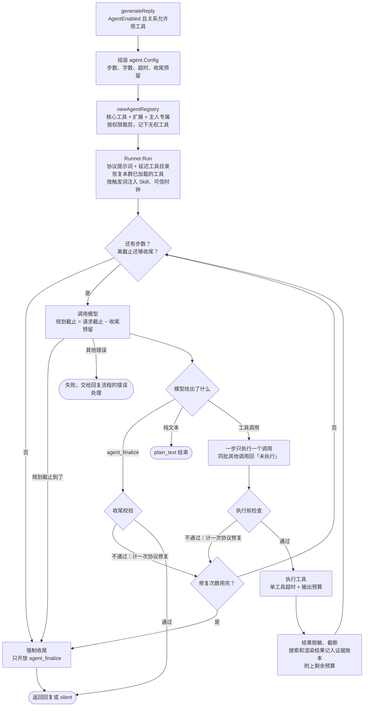
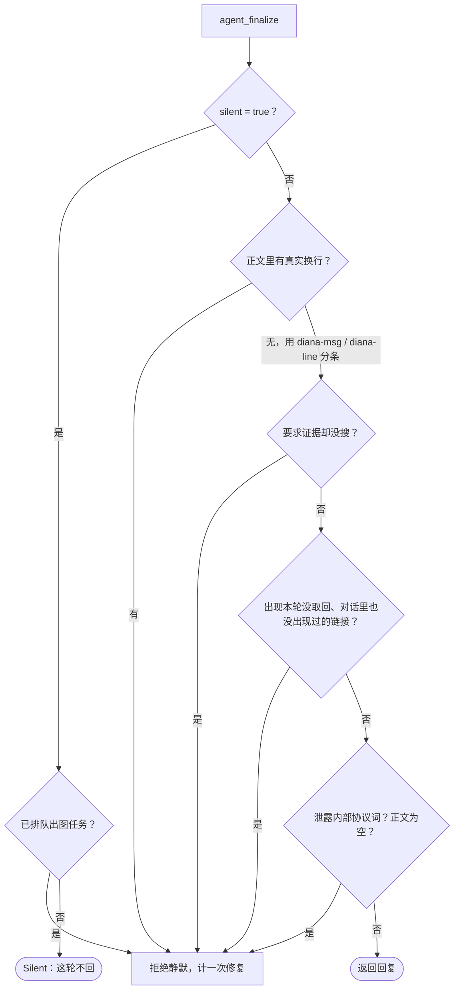

# Agent 运行

决定回复之后，如果机器人开了 Agent 且对方的关系允许用工具，这一轮回复由内置 Agent（`model/agent/runner.go` 的 `Runner.Run`）生成：模型每一步要么调用一个工具，要么用 `agent_finalize` 收尾。没开 Agent 时只做一次普通模型调用，不经过本文的循环。

总览见[消息链路总览](message-pipeline.md)，Agent 前后的环节见[回复流程](reply-flow.md)。

## 总流程

## 启动：带进 Agent 的东西

`generateReply`（`model/assistant/runtime.go`）在调用 `Runner.Run` 之前准备好这些：

- **预算**：默认 12 步、硬上限 16 步；主人 16 步、最终回复 20000 字，其他人按配置步数、8000 字。单个工具 60 秒，收尾预留 20 秒，协议修复 3 次（`model/agent/types.go`、`agent_scope.go`）。单条回复字数上限不超过 2000 时，还会在当前消息前插一条长度预算提示。
- **工具**：核心工具（`say`、`web_search`、历史图片、GitHub、画图、聊天记录、网页渲染、能力说明、戳一戳等）每轮直接可用；其余工具只在目录里列一行，要用先 `tools_load`，再通过 `tools_execute` 调用，见[延迟加载工具](deferred-tools.md)。`newAgentRegistry` 在共享的扩展底座（MCP、Skills）上叠加主人专属工具，再按权限白名单和机器人 / 群级扩展开关裁剪。对方没权限的工具会记进 `DenyTools`，模型调到时回答「没有权限」而不是「不存在」。编码代理只对主人开放。
- **调用者身份**：`agent.WithCallerIdentity` 把真实的平台、机器人、用户、群、消息 ID 和是否主人挂在 context 上，模型看不到。开了 `ExposeCallerIdentity` 的 MCP 服务器从 `_meta["diana/caller"]` 读到它，`run_command` 从 `DIANA_CALLER_*` 环境变量读到它。
- **提示词分层**：SOUL.md 和固定规则在最前，接着是摘要检查点和稳定历史，然后打缓存断点；断点之后才是插件上下文、会话状态、记忆、笔记本、世界书、自我笔记、媒体索引、最近引用来源和最近工具调用这些每轮会变的块，最后是说话人、时钟、装饰规则和当前消息。可变块大多由 `startPromptContextPreload` 并行预取。
- **续跑档案**：上一轮因步数用完、修复用完或时间不够被迫收尾时，留下的最多 12 条步骤摘要（10 分钟有效）会附在最后，让这一轮接着做，而不是从头再查一遍。
- **证据要求**：意图路由判断这条需要事实依据时设 `RequireEvidence`，只有 `web_search` 可用才生效。

群聊里已经 `tools_load` 过的工具保存在群会话快照里（`group_prompt_session.go`），下一轮直接恢复，不用重新加载；私聊每轮从空开始。工具被停用或撤权后不会恢复。

## 循环：一步只做一件事

每一步调用一次模型。模型的截止时间是整条消息的请求截止减去收尾预留（取配置值和剩余时间三分之一中较小的那个），这样无论工具跑多久，最后总留得出时间写回复。规划截止先到（而请求本身还没超时）时，追加一条「现在就总结」进入强制收尾。

模型一次返回多个工具调用时只执行一个，其他的回一条「未执行」结果：顺序执行让每一步都能看到上一步的结果，也让日志和预算可以逐步核算。同一批里带了 `agent_finalize` 时，先执行那个非收尾的调用。

执行前依次检查，任一项不通过都记为跳过的一步并计一次协议修复，修复次数用完就强制收尾：

1. **延迟工具分发**：非核心工具不能直接调，必须先加载；`tools_execute` 的参数按加载时和当前两份 schema 校验。
2. **未知或无权工具**：回目录或权限说明。
3. **参数纠正**：该传数组却传了字符串时自动包一层。
4. **扩展变更确认码**：安装、卸载、启用 Skill 或 MCP 服务器，要求当前这条用户消息里带着由 SHA-256 推出的确认码。这是 Runner 里唯一的审批环节。
5. **重复调用**：和上一步完全相同的调用直接跳过。
6. **配额**：`web_search` 每轮最多 3 次；自省类工具最多 6 次、`tools_load` 最多 4 次，这两类不占步数。

执行时工具拿到输出预算和截止时间（单工具超时与请求截止减预留，取较早的）。输出先按已登记的凭据脱敏，超长的截断并附说明；工具报错不会终止整轮，而是变成 `TOOL_EXECUTION_ERROR` 观察结果交给模型，照样占一步。`run_command` 先过命令白名单，再按 `off` / `auto` / `require` 决定是否放进 bubblewrap / sandbox-exec 沙箱，见[编码代理](coding-agents.md)；MCP 调用另有 60 秒超时。

### 一轮里的其他出口

- **`say` 中途说一句**：最多 3 次、每次 80 字以内、不能换行，直接发出去并重新点亮「正在输入」。说过之后这一轮不再被合并重来。见[中途说一句](interim-messages.md)。
- **`subtask` 子任务**：同步的、没有工具也没有历史的一次模型调用，每条回复最多 4 次、材料不超过 6000 字、90 秒超时，用来把大段材料的整理外包出去。
- **流式**：流式输出在 provider 最内层累积完整响应后才交给 Runner；可见文字增量只推给 Telegram 草稿这类观察者。
- **上下文超限**：请求超过 `MaxContextTokens` 时依次把最长的文本消息摘要（最多 2 次）、把图片换成描述、缩小图片、最后丢掉图片。

## 收尾

步数用完、修复次数用完、收尾预留时间到了、证据要求没满足这四种情况会进入**强制收尾**：追加收尾指令和证据账本摘要，只开放 `agent_finalize` 并强制模型调用它。强制收尾仍然为空时报 `errEmptyFinalize`；有出图任务排队时退回一句固定的「已经开始生成」。

回到 `generateReply` 之后：

- `rememberAgentRunProgress`：被迫收尾时存下续跑档案，正常结束时清掉。
- `rememberClaimSources`：记下本轮引用过的来源，下一轮可以接着引用。
- `rememberToolCalls`：最近最多 8 次工具调用保留 30 分钟，注入后续轮次。
- `Silent` 转成 `modelSilentFinishError`，由[发送前审核](pre-send-review.md)决定能不能真的沉默。

每个 `RunEvent`（模型调用、工具调用、跳过、修复、收尾）经 `agentRunObserver` 写进运行日志和调试追踪；平台和 GitHub 载荷脱敏，搜索日志去掉用户和群标识。

## 失败处理

- **模型报错**：Runner 自己不重试。重试在 provider 栈里：瞬时错误 700 毫秒后重试一次；上下文超长时减半重试，最多 4 次；再不行按配置顺序切换到下一个模型配置。切换发生在单次 `Generate` 内部，已经完成的工具步骤不会丢。消息里带图片或音频时，这一步自动走视觉模型分组。
- **工具报错**：不致命，变成观察结果，占一步。
- **取消**：模型调用和工具都继承整条消息的请求超时。同一人追加的补充消息在发送时被识别出来，整轮重新生成，最多 3 次（见[回复触发](reply-trigger.md)）。Runner 内部除了 context 没有别的中途取消钩子。

## 相关代码

- `model/agent/runner.go`：主循环、执行前检查、强制收尾
- `model/agent/finalize.go`、`claim_evidence.go`、`rendered_tool_call.go`：收尾协议与校验
- `model/agent/deferred_tools.go`、`tool_input_coercion.go`、`extension_confirmation.go`、`command_sandbox.go`、`mcp.go`
- `model/assistant/runtime.go`：`generateReply`、`replyTo`
- `model/assistant/agent_scope.go`、`agent_run_carryover.go`、`agent_tool_log.go`、`tool_call_memory.go`、`subtask_tool.go`、`interim_message_tool.go`
