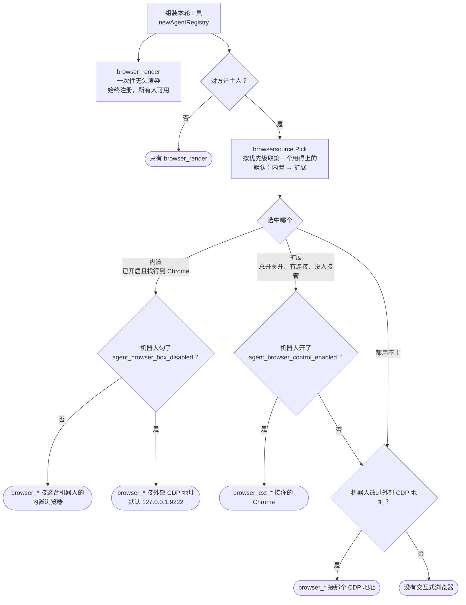
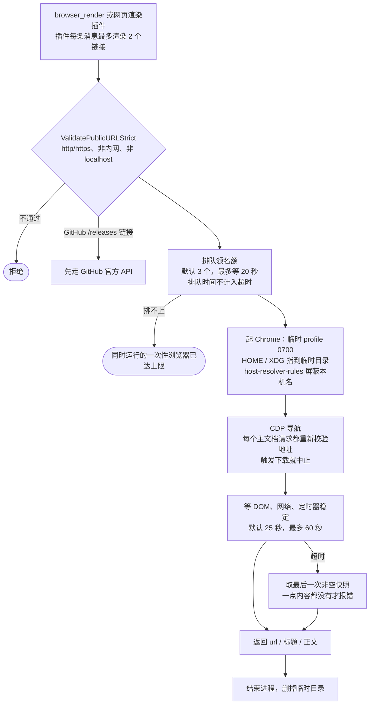
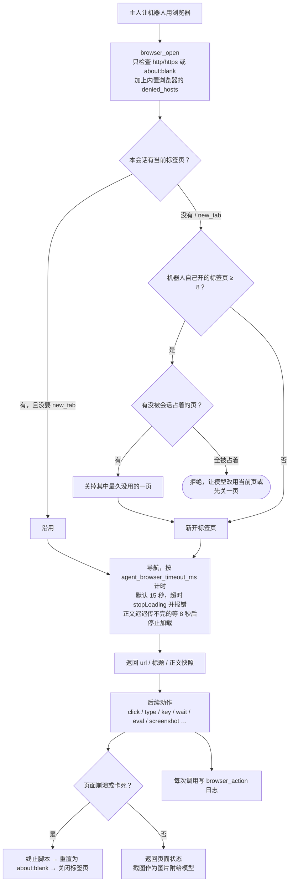

# 浏览器机制总览

Diana 用到浏览器的地方有三类，它们是三套互不替代的东西：

- **一次性无头浏览器**：每次调用起一个全新的 Chrome 进程和临时 profile，用完即删。读公开网页（`browser_render`）、把 HTML / Markdown / Mermaid 渲染成图片都靠它。所有人可用。细节见[浏览器依赖与一次性渲染](browser-rendering.md)。
- **带登录态的交互式浏览器**：能点、能输入、能截图，只有主人能驱动。来源有两个，每轮只用其中一个：
  - **Diana 内置浏览器**：每台机器人一个常驻 Chrome，WebUI 里能看实时画面、能接管。见[内置浏览器](browser-builtin.md)。
  - **你自己的 Chrome**：通过浏览器控制扩展下发有限的几条指令。见[浏览器控制扩展](browser-control.md)。
- **外部 CDP**：机器人配置里的 `agent_browser_cdp_url`，指向任何开着远程调试端口的 Chrome。

总览见[消息链路总览](message-pipeline.md)。

## 这一轮用哪个浏览器

每一轮回复在组装工具时决定注册哪一套浏览器工具，模型只会看到一套，不会同时拿到两套再自己去猜。

几个容易误会的地方：

- **内置浏览器被接管时不会切到扩展。** 可用性只看「开着且找得到 Chrome」，接管期间 `browser_*` 调用直接报「用户正在人工接管内置浏览器」。扩展那边正好相反：所有连接都在接管时算作不可用，会轮到下一个来源。
- **扩展是来源、机器人却没开 `agent_browser_control_enabled` 时**，这台机器人没有交互式浏览器，不会回落到内置浏览器（除非它自己配了非默认的外部 CDP 地址）。
- **机器人勾了 `agent_browser_box_disabled`、而来源是内置**时，`browser_*` 仍会注册，但接到外部 CDP 地址上；那里没有浏览器时调用失败。
- 群成员的工具面里只有 `browser_render`（`RelationshipPolicy.allowedAgentToolNames`），碰不到任何带登录态的浏览器。

## 一次性无头渲染

- 插件被动渲染时，正文以「不可信内容」块注入上下文；Agent 主动调用时，结果作为工具输出交回模型。
- 只有主文档请求被拦截重验，页面里的 XHR、图片等子资源请求不逐个校验地址。
- HTML 转图片有两条路：简单页面走 Chrome 的 `--screenshot`（产物上限 8 MiB，占名额）；带脚本或动画的页面走 `html_capture`，页面放在假域名 `https://diana-render.invalid` 下，所有请求要么由本地资源应答、要么被拦，另有严格 CSP、指向死端口的代理和虚拟时钟，最多 600 帧、4096 像素。`html_capture` 目前不占上面那 3 个名额。
- 找浏览器的顺序：配置路径 → `DIANA_HEADLESS_BROWSER_EXECUTABLE` → `DIANA_AGENT_BROWSER_EXECUTABLE` → 各系统常见安装位置（含下载来的 Chrome for Testing）→ `PATH`。安装先用系统包管理器，glibc Linux（amd64 / arm64）上没有包管理器时退回下载 Chrome for Testing Stable 到 `DIANA_BROWSER_DIR`（默认跟着数据库目录的 `browser/`）。安装后用 `--version`、一次 64×64 截图和一次沙箱内 CDP 求值三步验证。

## 交互式浏览器（内置 / 外部 CDP）

- **进程**：内置浏览器每台机器人一个进程，profile 在 `browser-box/profiles/<机器人 ID>/profile`。首次用到或在浏览器页选中这台机器人时才启动，并发启动会等同一次启动；启动超时 30 秒；崩溃后 3 秒重启。没有显示器又要开真窗口时自己拉起 Xvfb。修改宽高、有头 / 无头或可执行文件会重启正在运行的进程。不会因为空闲自动关闭。
- **标签页**：每个会话（机器人 + 群或私聊对象）记住自己的当前标签页，空闲 1 小时后忘掉；一个标签页在被用过后 10 分钟内算作该会话占用。CDP 调用超时取 `agent_browser_timeout_ms`（默认 15 秒，最多 60 秒）。
- **动作**：点击和按键用真实的 `Input.dispatch*` 事件，被遮挡时退回 `el.click()`；输入用 `Input.insertText`。交互式浏览器工具允许连续相同调用（比如连按两次 Tab、滚两次页），不会被当成重复调用跳过。`browser_eval` 的返回值里出现的 Cookie 值会被打码。
- **截图**：保存在工作目录 `.agent-browser/` 下，每个会话一个文件、权限 0600、7 天后清理，同时作为图片附给模型。
- **接管**：主人在实时画面上点击、按键或跳转就自动接管，此时机器人的浏览器调用全部被拒；5 分钟没有输入自动交还。没接管时画面上的悬停和滚动不会转发给浏览器。
- **网络边界**：交互式浏览器只做 scheme 检查和 `denied_hosts`，不走 netguard，因此能访问局域网地址；也没有下载策略。这是有意的——它是主人自己的浏览器，只有主人能驱动。

扩展那一侧（`browser_ext_*`）的授权模型、站点白名单、限速和不做截图的原因见[浏览器控制扩展](browser-control.md)。

## 日志

- 每个 `browser_*` 和 `browser_ext_*` 调用写一条 `browser_action`：网址或选择器、按键、标签页操作、耗时、失败原因、触发消息和机器人 ID。输入的文字只记字数，执行的脚本记字数和开头 500 字。
- `browser_render` 在插件被动渲染时由插件记；Agent 主动调用时只有通用的 `agent_tool` 记录。
- 你在 WebUI 里的启动、接管、交还和导航记为 `browser_box_*`。

## 相关代码

- `model/browsersource/source.go`、`webui/browser_source.go`：来源优先级与可用性
- `model/assistant/runtime.go`：`browserToolsDisabledFor`、`browserBoxFor`、`browserControlFor`
- `model/agent/headless_browser*.go`、`headless_screenshot.go`、`html_capture.go`、`browser_limits.go`：一次性渲染
- `model/agent/browser_tools.go`、`browser_actions.go`、`browser_page_health.go`、`browser_control_tools.go`：交互工具
- `model/browserbox/`：内置浏览器进程管理与接管
- `model/browserctl/`：扩展控制面
- `model/netguard/public_http.go`：公网地址校验
- `model/assistant/browser_dependency.go`、`browser_download.go`、`browser_action_log.go`
