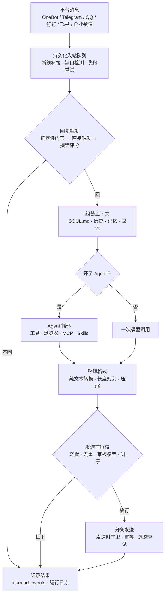

# 消息链路总览

一条消息从平台进来，到回复发出去，中间经过五段。每段一篇文档，都带流程图：

| 阶段 | 文档 | 回答的问题 |
| --- | --- | --- |
| 1 | [消息进入与回复触发](reply-trigger.md) | 消息会不会丢？断线期间的消息怎么补回来？要不要回？ |
| 2 | [回复流程](reply-flow.md) | 决定要回之后，上下文怎么组、回复怎么整理、怎么分条发回去？ |
| 3 | [Agent 运行](agent-run.md) | 开了 Agent 时，模型怎么一步步调工具、什么时候收尾？ |
| 4 | [浏览器机制](browser.md) | Agent 用到网页时，走哪个浏览器、谁能用、边界在哪？ |
| 5 | [发送前审核](pre-send-review.md) | 生成出来的回复在发出去之前，哪些检查能拦下或改写它？ |

每条消息无论回没回，最后都会写一条结果：`decision` 是结果代码（例如 `replied`、`ignored_policy`、`ignored_proactive_reply_quality`），`decision_reason` 是给人看的原因。WebUI 事件中心和运行日志里看到的「为什么没回」「为什么这条被丢了」都来自这里；想排查某条消息时，先看它停在了哪一段，再去对应文档里找那个结果代码。

## 常见结果代码在哪一段

| 结果代码 | 阶段 |
| --- | --- |
| `ignored_stale`、`backfill_history_only`、`dropped_retries_exhausted` | 入站队列 |
| `ignored_policy`、`ignored_user_blocked`、`ignored_bot_muted`、`ignored_member_level`、`ignored_response_suppression`、`ignored_reply_damping`、`ignored_bot_message` | 确定性门禁 |
| `ignored`、`replied_proactive` | 接话评分 |
| `merged_into_reply`、`merged_into_backlog_turn`、`superseded_follow_up`、`superseded_reply_turn`、`superseded_proactive` | 并发与合并 |
| `ignored_model_silent`、`ignored_no_natural_reply`、`ignored_duplicate_reply`、`ignored_proactive_reply_quality`、`ignored_stop_requested`、`ignored_conversation_closed`、`ignored_self_repeat`、`ignored_ai_reply_loop` | 发送前审核 |
| `ignored_unavailable_group`、`dropped_send_rejected` | 发送 |

## 相关文档

- [发言偏好](participation.md)：接话档位、冷却与补充判据
- [判断模型（Jev）](decision-models.md)：只做判断、不写字的模型怎么接进接话评分和审核
- [延迟加载工具](deferred-tools.md)、[中途说一句](interim-messages.md)：Agent 的工具目录和中途发言
- [群提示词缓存](group-prompt-cache.md)：上下文怎么排才能让前缀缓存命中
- [内置浏览器](browser-builtin.md)、[浏览器控制扩展](browser-control.md)、[浏览器依赖与一次性渲染](browser-rendering.md)
- [图片发送与重试](media-send-recovery.md)、[引用回复](quoted-replies.md)
