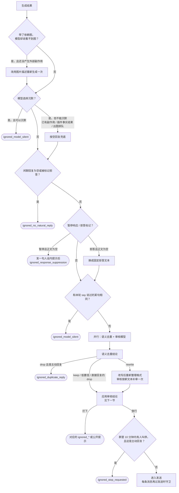
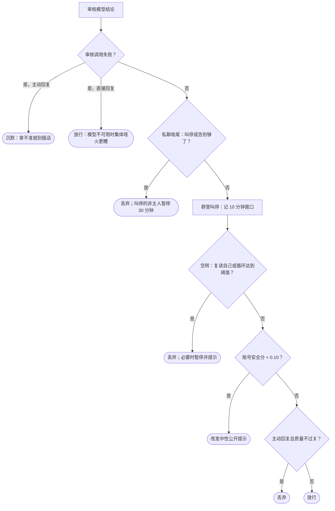

# 发送前审核

回复生成出来之后、真正发出去之前，还有一串检查可以丢弃、改写或推迟它。其中只有一次是专门的审核模型调用（`auditReplyBeforeSend`），其余是便宜的程序检查和语义去重。本文按执行顺序列出每一项的条件、结果和日志位置。

总览见[消息链路总览](message-pipeline.md)；这些检查在[回复流程](reply-flow.md)里的位置是「整理格式」之后、「发送」之前，以及发送时的每一条消息上。

## 总流程

## 生成之后的程序检查

| 检查 | 条件 | 结果 |
| --- | --- | --- |
| 看图拒答 | 附了依赖图，回复却说看不到图（`VisionDescriptionRefused`），且本轮还没产生外部副作用 | 改用图片描述代替像素，重新生成一次 |
| 模型沉默 | `agent_finalize silent=true` | 沉默，记 `ignored_model_silent`；但本轮已有外部副作用、插件给出了事实结果或有出图任务排队时不允许沉默（`modelSilenceRefusedReason`），按空回复兜底 |
| 工具调用写成文字 | 回复像是渲染出来的工具调用 | 按错误处理，不发 |
| 长度 | 超过单条字数上限 | 拆分、压缩；压缩失败给公开提示 |
| 闲聊没话可说 | 闲聊回复为空、或被标记拒答 / 暂停 | `ignored_no_natural_reply` |
| 暂停响应标记 | `[[DIANA_IGNORE_CURRENT_USER_30M]]` | 对这个人暂停响应，正文为空时发一句人设内提示后沉默 |
| 拒答标记 | `[[DIANA_REFUSE_CURRENT]]` | 正文为空时发固定拒答文本；发出后计入拒答次数 |
| 重复中途的话 | 收尾正文和本轮 `say` 说过的某句一模一样 | 不发第二次 |

## 语义去重

`reply_semantic_gate.go` 只在这个会话 2 分钟内发过回复时才运行，拿对方这次的请求和引用、以及最近发过的回复让判断模型比较，60 秒超时。本轮已有外部副作用、插件给了事实结果、或带着拒答 / 暂停标记时跳过。

- 置信度低于 0.9、出错或超时：一律放行（fail-open）。
- `keep`：确认有新内容。之后审核里的「复读自己」以此为准，不按复读丢、也不计空转。
- `drop`：**只有主动回复会被丢**（`ignored_duplicate_reply`）；直接回复被点着名，不能因为像重复就装死，记为 `drop_blocked` 后照常发。
- `rewrite`：改写结果先校验，再重新整理格式。

日志动作 `reply_semantic_dedup`。

## 审核模型

审核只有开和关两档（`ReplySafetyMasterEnabled`，默认开，群配置可单独覆盖）。一次调用同时判断下面几项，哪一项都不需要时整个跳过。为了省时间，审核和语义去重同时开始；去重改写了回复时，按新文本补审一次，空转计数、收尾这些副作用只对最终发出去的那一版执行一次。

| 项目 | 什么时候判 | 判出来之后 |
| --- | --- | --- |
| 私聊收尾 / 叫停 | 私聊里机器人上一条发出 3 分钟内 | 叫停：这条不发，非主人再暂停响应 30 分钟（`ignored_stop_requested`）；互相道别超过宽限次数：不再追加告别（`ignored_conversation_closed`）。只认置信度 ≥ 0.90 的结论 |
| 群里叫停 | 群里 @、引用或点名机器人的消息 | 给本群记 10 分钟叫停窗口；**这一条照常发** |
| 空转 | 开了机器人互聊检测（默认开）且够得上循环候选 | 复读自己：丢弃（`ignored_self_repeat`）；30 分钟内判中 3 次且对方不是主人：暂停响应并提示（`ignored_ai_reply_loop`）；没内容 / 没目的时降低回复欲望 |
| 账号安全 | 审核开着 | 安全分低于 0.10 时拦下，改发中性的公开提示（可按人设改写，关了错误通知就不发） |
| 表达质量 | **只对主动回复** | 判出自相矛盾、答非所问、被截断、有害建议，或 `send_confidence` 低于 `proactive_reply_threshold`：丢弃（`ignored_proactive_reply_quality`） |
| 拒答计数 | 审核判出这是一次拒答（置信度 ≥ 0.90） | 照常发；30 分钟内累计 4 次拒答后暂停响应 |

顺序是有意的：对方都说「别回了」，再纠结这条够不够准确没有意义，所以收尾排最前。质量门槛只给主动回复——被点名在说话却因为一个打分沉默，对方看到的就是装死。

插件直接给出的回复也过同一次审核（主动回复判质量，其他判账号安全），但不做语义去重。`say` 中途说的话不过审核，靠长度和次数上限兜底。

## 发送时守卫

审核放行之后，每一条消息在 `sendOutgoingWithResult` 里还要过一遍：

| 守卫 | 条件 | 结果 |
| --- | --- | --- |
| 凭据打码 | 文本里出现已登记的凭据（`secretmask`） | 替换成打码后的文本 |
| 提及与引用标记 | `[diana-at]` / `[diana-reply]` 格式不对或指向不存在的消息 | 改写或去掉 |
| 群不可用 | 之前已确认退群或群被禁用 | 丢弃，`ignored_unavailable_group` |
| 暂停响应 | 对这个人的暂停期内 | 丢弃，`ignored_response_suppression` |
| 补充消息 | 同一轮里对方补了一句，被合并进来 | 这一版作废，带着补充重新生成 |
| 被新消息取代 | 群里同一个人又直接叫了机器人；或这条消息已被合并进别的轮次；或主动接话批次已经变了 | 丢弃，`superseded_follow_up` / `superseded_reply_turn` / `superseded_proactive` |
| 幂等 | 这一步已经发过 | 跳过，复用原来的消息 ID |
| 禁言 / 离线 / 退避 | 机器人被禁言；连接离线；群发送退避中 | 禁言丢弃；离线交给入站队列重试；退避等待，窗口用尽后丢弃 |

打断和取代只在还没开始分条发送、也没产生外部副作用时生效；已经发出第一条的回复会发完。

合并转发卡片在发出前另做一次只看账号安全的审核，审核调用失败时放行。

身份脱敏不是发送时检查：真实 ID 在发给模型时就换成了别名，回复里再换回来。模型信息和仓库信息的披露控制只决定注册哪些工具，不过滤回复文本。

## 相关代码

- `model/assistant/runtime.go`：`replyTo` 里的审核编排
- `model/assistant/proactive_reply_quality.go`：`replyAuditNeed`、`prepareReplyAudit`、`applyReplyAudit`
- `model/assistant/reply_audit_decision.go`：判断模型的审核题目
- `model/assistant/reply_semantic_gate.go`、`private_closing.go`、`group_stop.go`、`reply_suppression.go`、`model_silence.go`、`vision_refusal.go`
- `model/assistant/runtime_outbound.go`、`reply_interrupt.go`、`outbound_forward_gate.go`、`outbound_idempotency.go`、`group_send_guard.go`
