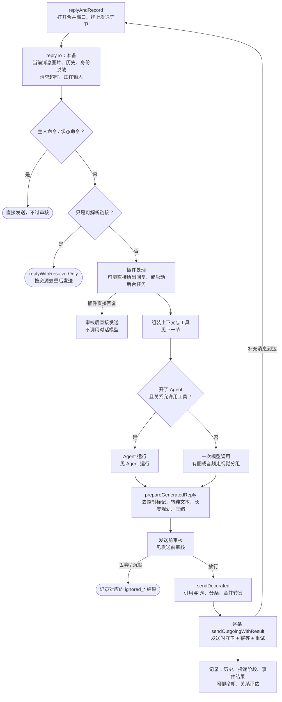
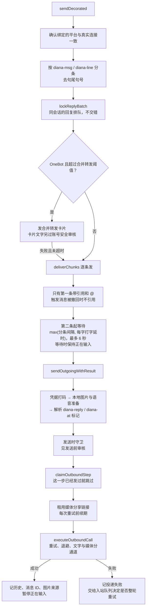

# 回复流程

[回复触发](reply-trigger.md)决定要回之后，`replyAndRecord`（`model/assistant/runtime.go`）接手：组装上下文、生成、整理格式、过[发送前审核](pre-send-review.md)、分条发回来源通道，最后把结果记下来。本文按这个顺序讲。

总览见[消息链路总览](message-pipeline.md)。

## 总流程

`replyTo` 最多跑 3 次：同一个人在生成期间补了一句、被判为补充或纠正时，旧的这版作废，带上新消息重新生成；第 3 次之前封口，不再接受合并。

## 组装上下文

- **提示词顺序**：系统头（SOUL.md、固定规则、工具规则）→ 摘要检查点 → 稳定历史 → 缓存断点 → 可变块（插件上下文、会话状态、记忆、笔记本、世界书、自我笔记、媒体索引、最近引用来源、最近工具调用）→ 同轮候选消息 → 依赖图 → 系统尾（说话人）→ 时钟 → 装饰规则 → 当前消息。断点之前的内容在同一个群里轮与轮之间保持不变，让上游的前缀缓存命中，见[群提示词缓存](group-prompt-cache.md)。
- **当前消息的媒体**：视频抽帧、语音转写和 OCR 结果附在当前消息上；同一个人刚发的图作为候选依赖图单独附上。
- **身份脱敏**：发给模型的请求里，真实的用户 ID、群号换成别名；回复和工具调用里再换回来（`llm_identity_privacy.go`）。
- **回复规则**：`evaluateReplyRules` 命中的规则可以指定这一轮用哪个模型配置，或把回复换成语音。
- **模型选择**：规则指定的配置优先，其次是按用途绑定的配置，再是分组里的配置，最后是回退配置，外面套一层故障切换。

## 整理格式

`prepareGeneratedReply`（`reply_compression.go`）：

1. 取出控制标记（暂停响应、拒答等），交给审核阶段处理。
2. 回复看起来像把工具调用写成了文字，按错误处理，不发出去。
3. `normalizeReply`：去掉隐藏文本；平台不支持富文本时把 Markdown 转成纯文本。
4. 长度检查：超过单条字数上限（Telegram 另按 UTF-16 长度）时，先在自然边界拆分、把超长代码块单独拆开，还不行就调用模型压缩（30 秒超时，每条回复最多 2 次），压缩结果也要过校验；失败时报 `errReplyCompression` 并给出公开提示。

生成结果为空时按标记处理：暂停响应就发一句人设内的提示后沉默；拒答发固定文本；有出图任务在排队就把「开始生成」当回复；这一轮已经用 `say` 说过话就沉默；都不是时发「我这边没有生成有效回复。」

## 发送

- **引用与 @**：只有第一条带引用和 @，是否引用、是否 @ 由机器人的引用模式和提及模式决定；回复针对的是另一位参与者时，不引用当前消息。见[引用回复](quoted-replies.md)。
- **节奏**：分条间隔默认 300 毫秒，是防风控的下限；打字延时默认每字 100 毫秒，两者取大，最多 6 秒。第一条之前不额外等，因为生成本身已经花了时间。「正在输入」只在 Telegram 和 OneBot 私聊上显示。
- **幂等**：每一步发送按指纹记在本轮的投递账本里（`outbound_idempotency.go`）。入站队列整轮重试时，已经发出去的那几条直接跳过、复用原来的消息 ID，不会重复发。
- **重试**：聊天回复在单次调用内只发一次，不走 `send_retry_attempts`（那是定时推送等非回复发送用的，默认 3 次、间隔 700 毫秒递增）。平台因媒体校验拒收时会短暂重试，连同第一次最多 3 次。群聊开了发送退避时，失败交给群发送退避：文字和媒体各走一条通道互不阻塞，指数退避加抖动，退避窗口用尽后进入丢弃冷却。机器人已被踢或被禁言时直接放弃。连接离线时快速失败，由入站队列稍后重试整轮（已发出的分条靠幂等账本跳过）。图片分享链接在重试期间保持有效，见[图片发送与重试](media-send-recovery.md)。
- **合并转发**：OneBot 上超过阈值的长回复发成合并转发卡片；卡片失败且请求还没超时时，退回逐条发送。

## 发送之后

- 投递成功：记 `Acknowledged`、写入聊天历史（含图片缓存和插件观察）、记下消息 ID 供之后引用。
- `applyReplyControlAfterSend`：记录回复抑制和拒答计数。
- 语义去重只在回复真正发出去后才记住这次请求。
- 闲聊回复发出去之后才开始闲聊冷却；随后排入关系评估。
- 入站队列：成功时 `CompleteInboundEvent` 并清掉投递账本；平台明确拒收或重试用尽时终止；其他失败 `RetryInboundEvent`。
- 事件结果、原因、回复正文、耗时和投递阶段写进 `inbound_events`，WebUI 事件中心按这些字段展示。

## 中途说的话

Agent 用 `say` 中途说的话走同一个 `sendOutgoing` 出口，照样记进历史、去句号，但不过发送前审核，也不带引用。见[中途说一句](interim-messages.md)。

## 相关代码

- `model/assistant/runtime.go`：`replyAndRecord`、`replyTo`、`generateReply`、`sendDecorated`
- `model/assistant/reply_compression.go`、`reply_length_plan.go`、`reply_format.go`、`reply_delivery_mode.go`
- `model/assistant/runtime_outbound.go`：`deliverChunks`、`sendOutgoingWithResult`
- `model/assistant/group_send_guard.go`、`outbound_media_lane.go`、`send_retry_policy.go`、`outbound_idempotency.go`、`media_lease.go`
- `model/assistant/typing_delay.go`、`typing_indicator.go`、`reply_batch.go`
