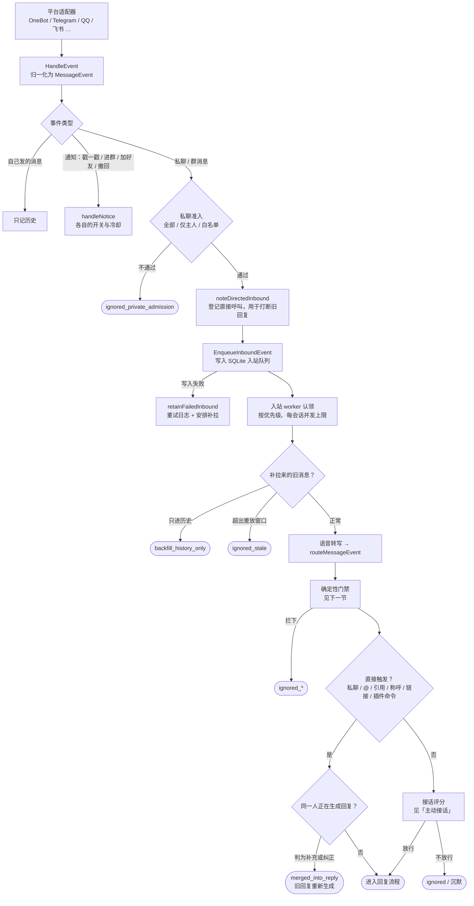
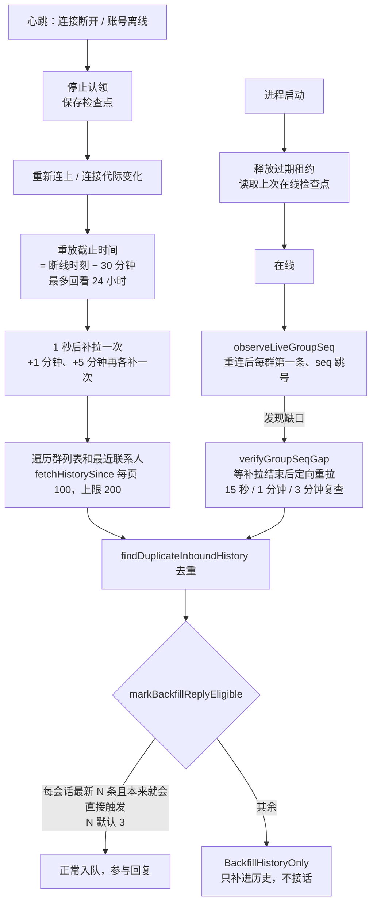
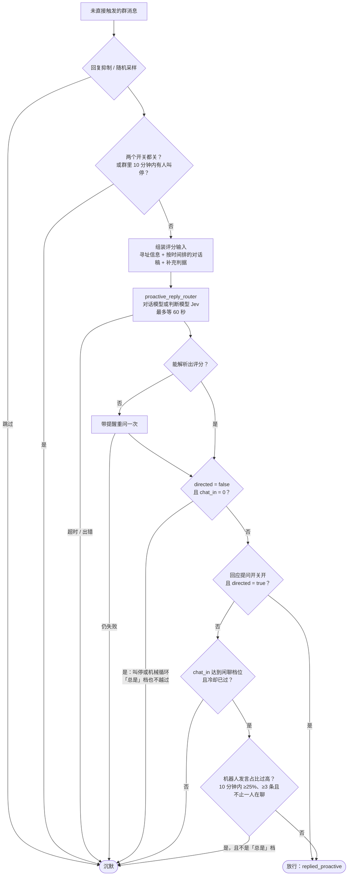
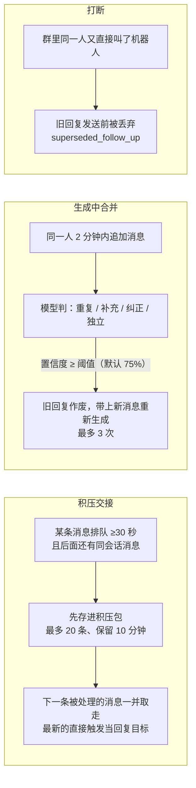

# 消息进入与回复触发

一条平台消息到达后，Diana 要回答两个问题：这条消息会不会丢、要不要回。前者由持久化入站队列和断线补拉负责，后者由一串确定性门禁加上一次接话评分决定。本文按代码里的真实顺序讲这条链路；决定回复之后发生什么，见[回复流程](reply-flow.md)。

总览见[消息链路总览](message-pipeline.md)。

## 总流程

每个出口都会写回 `inbound_events` 的 `decision` 和 `decision_reason`，WebUI 事件中心看到的「为什么没回」就来自这里。

## 入站队列

`HandleEvent`（`model/assistant/runtime_inbound.go`）不直接生成回复，而是先把消息写进 SQLite 入站队列再唤醒 worker。这样进程崩溃、重启或者模型卡住时，消息还在库里：worker 认领时拿的是 10 分钟租约，租约过期别的 worker 会重新认领。

- **优先级**：直接触发 100、引用回复 80、可解析链接 60、其余 0（`inboundEventPriority`）。同优先级按消息时间排。
- **每会话并发**：默认群 3 条、私聊 2 条同时在处理，全局再受回复信号量限制。
- **失败重试**：处理出错按 5 秒起、翻倍到 5 分钟重试，最多 5 次，用尽记 `dropped_retries_exhausted`；平台明确拒收记 `dropped_send_rejected`，不再重试。
- **写不进队列**：`retainFailedInbound` 先写进重试日志，`runInboundRetries` 以 2–30 秒退避重放，同时安排一次历史补拉兜底。

没有配置存储时（测试或极简嵌入）走旧路径，直接起一个 goroutine 处理。

## 断线补拉与恢复

机器人掉线期间平台上的消息，Diana 收不到推送，只能事后向平台拉历史。协调器 `runInboundCoordinator`（`inbound_queue.go`）负责这件事。

补拉消息的回复边界是有意收紧的：掉线一小时回来，对攒下的上百条群聊逐条接话只会刷屏，所以只有每个会话最新几条、本来就会直接触发回复的消息（@、引用、私聊等）才进回复流程，数量由 `history_backfill_message_limit` 控制，其余只补进历史供上下文使用。补拉消息的时间早于重放截止时间时判为 `ignored_stale`；从重试日志恢复的消息只按 24 小时窗口判断过期。

缺口检测的日志动作是 `backfill_gap_detected` / `backfill_gap_resolved` / `backfill_gap_unresolved`，队列写入失败是 `inbound_event_retained` / `inbound_event_lost`。

## 确定性门禁

`routeMessageEvent`（`runtime.go`）按下面的顺序检查，任何一步拦下都会带着具体原因结束。这些检查不调用模型，结果稳定可复现。

| 顺序 | 检查 | 拦下时的结果 |
| --- | --- | --- |
| 1 | 机器人已退群或群不可用 | `ignored_unavailable_group` |
| 2 | 补全引用、转发、图片，插件观察，写入历史 | — |
| 3 | 群未启用 / 不在准入范围（主人的抑制命令例外） | `ignored_policy`，被屏蔽的用户记 `ignored_user_blocked` |
| 4 | 机器人在该群被禁言 | `ignored_bot_muted`；开了「禁言期间仍判断」则跑完判断再记 `ignored_bot_muted_judged` |
| 5 | 群模型配额用尽 | `ignored_model_quota` |
| 6 | 事件触发器（关键词 / 正则任务） | 不拦截，任务在后台照常跑 |
| 7 | 主人的清空上下文命令 | 立即处理 |
| 8 | 积压交接（见「并发与合并」） | `merged_into_backlog_turn` |
| 9 | 群成员等级门槛（OneBot；@、主人、管理员豁免） | `ignored_member_level` |
| 10 | 响应抑制期内 | `ignored_response_suppression` |
| 11 | 只有视频没有文字 | `ignored_video` |
| 12 | 发送者是被标记的机器人或 Telegram bot，且没有明确 @ 或引用本机器人 | 先过回复抑制，再用模型判断是不是在跟自己说话；否则 `ignored_reply_damping` / `ignored_bot_message` |

然后 `shouldHandle` 判断是否**直接触发**。它要求先通过回复准入 `replyGateAllows`（主人直通 → 屏蔽名单 → 白名单 → 豁免 → 活跃时段 → 群等级），再满足以下任一条件：

- 私聊；
- 群里 @ 了机器人，或引用了机器人的消息；
- 命中称呼（`alias_trigger.go`，宽松 / 智能 / 严格三种结构匹配）；
- 主人命令；
- 可解析的链接（B 站、YouTube、X 等）；
- 插件命令。

显式 @ 的优先级高于引用。引用机器人的消息会被记为 `replied_direct_followup`。

## 主动接话

没有直接触发的普通群消息，先过两道便宜的检查：回复抑制（`replyDampingJudge`）和群的随机采样比例（`groupReplySampleSkips`，主人豁免），然后交给接话评分 `routeProactiveReplyBatch`。

模型对每条候选返回两项：

- `relevance.directed`：是不是明确在跟机器人说话，只有是或否。这类问题给分数只会让模型在 0.45 和 0.55 之间摇摆，所以不打分。
- `chat_in.score`：0–1 的闲聊适合度，附理由。

闲聊档位与门槛：

| 档位 | 界面名称 | 放行条件 |
| --- | --- | --- |
| `off` | 从不闲聊 | 不闲聊 |
| `minimal` | 很少插话 | ≥ 0.90 |
| `low` | 偶尔接话 | ≥ 0.70 |
| `medium` | 适度参与 | ≥ 0.50 |
| `high` | 积极参与 | ≥ 0.30 |
| `extreme` | 频繁参与 | ≥ 0.10 |
| `always` | 完全不限制 | 不看分数，仍受冷却和发言占比限制 |

闲聊冷却默认 30 秒，只在闲聊回复真正发出去后才开始计时。模型出错、超时或输出解析不出来时一律沉默：以前超时会退回关键词规则（扫到问号就当公开提问），判错的方向是「本来不该说话却开口」，所以删掉了。

没放行时如果处在非活跃时段，`maybeNotifyQuietHours` 每个会话每小时最多提示一次。评分细节写在 `proactive_reply_route` 日志里，含两项评分、生效档位、原始输出和 `custom_criteria`。判断模型的接入见[判断模型（Jev）](decision-models.md)，档位和补充判据见[发言偏好](participation.md)。

## 并发与合并

同一会话里消息来得快，有三种机制避免「一条一回」或者答非所问：

- **积压交接**（`inbound_backlog_merge.go`）只看第一次处理的消息，主人的消息不交接（确认码、响应限制要在自己那一轮生效）。没有直接触发时，积压包里能接话的候选一起交给接话评分挑。
- **生成中合并**（`direct_reply_merge.go`）：独立问题、无法确定、超时和无效响应都不合并；已经开始分条发送或已经产生外部副作用的回复不再合并。
- **打断**（`reply_interrupt.go`）只在群聊生效；撤回消息只去掉引用装饰，不取消回复。

## 群里叫停

在群里 @、引用或点名机器人说「闭嘴」「别说了」，发送前审核会顺带判出叫停，给本群记一个 10 分钟窗口（`group_stop.go`）。窗口内接话评分直接跳过不调模型，在路上的主动接话回复发送前丢掉；但 @、引用和点名照常回答——叫停说的是别插话，不是不理人。

## 相关代码

- `model/assistant/runtime_inbound.go`：`HandleEvent`
- `model/assistant/inbound_queue.go`、`inbound_gap.go`、`inbound_retry.go`、`inbound_backlog_merge.go`：队列、补拉、缺口、重试、积压
- `model/assistant/runtime.go`：`routeMessageEvent`、`shouldHandle`、`routeProactiveReplyBatch`
- `model/assistant/participation_single_score.go`：评分解析与放行
- `model/assistant/direct_reply_merge.go`、`reply_interrupt.go`、`group_stop.go`：合并、打断、叫停
- `model/storage/inbound_queue.go`、`event_audit.go`：队列表与决策记录
